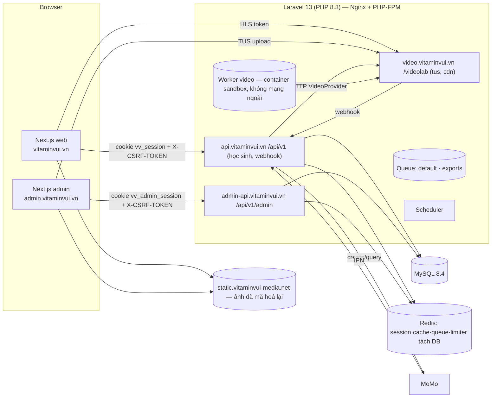

# TECH: Kiến trúc tổng thể VitaminVui MVP (US-001 → US-014, + US-015..018 bổ sung)

**Stories:** `docs/stories/US-001` … `US-014` · **Design UI:** `docs/design/US-0xx-*.md` + `docs/design/mockups/` (tên component Blade chỉ là tham chiếu — UI làm bằng Next.js)
**Tài liệu con:** [data-model.md](data-model.md) · [api-contract.md](api-contract.md) · [tasks.md](tasks.md) · [review-traceability.md](review-traceability.md)
**ADR:** [ADR-001 Thanh toán MoMo](../adr/ADR-001-cong-thanh-toan-momo-va-abstraction.md) · [ADR-002 Video nội bộ mô phỏng Bunny](../adr/ADR-002-dich-vu-video-noi-bo-mo-phong-bunny.md) · [ADR-003 1 thiết bị/1 phiên](../adr/ADR-003-mot-thiet-bi-mot-phien-hoc-sinh.md) · [ADR-004 Nền tảng/topology/phân quyền](../adr/ADR-004-nen-tang-api-nextjs-sanctum-phan-quyen.md)
**Review đã xử lý (2026-09-25):** Security `docs/security/audit-2026-09-25.md` (S1–S24) · DBA `docs/db/design-review.md` (10 điểm) — truy vết ở [review-traceability.md](review-traceability.md).

> **Stack (Quyết định của PO 2026-09-25, CLAUDE.md):**
> - Backend: **Laravel 13 / PHP 8.3 / MySQL 8.4 LTS (InnoDB)**, chỉ làm API JSON (PO chốt dùng Laravel 13 ngay từ đầu).
> - Frontend: **2 app Next.js + Tailwind + TypeScript** — web học sinh `vitaminvui.vn` và quản trị `admin.vitaminvui.vn` (origin riêng).
> - Staging dùng tên miền hoàn toàn khác.
> - Hạ tầng mặc định: **Nginx + PHP-FPM trên Ubuntu, chạy Docker** (chờ PO xác nhận).

## 1. Tóm tắt giải pháp

**Xác thực.** Laravel 13 phục vụ 2 host API (`api.` cho học sinh, `admin-api.` cho quản trị). Xác thực dùng **Sanctum SPA cookie**:
- Cookie host-only riêng cho từng host; CSRF gửi qua header.
- Khu quản trị có thêm: kiểm origin, MFA email cho admin/QLT, idle timeout 120 phút.

**Phân quyền.** Dùng cột `users.role` + Policy; route lồng nhau dùng `scopeBindings` và kiểm quyền theo khóa gốc của bản ghi con.

**Tổ chức code.** Nghiệp vụ đặt trong Service theo domain. Chỉ có interface ở những chỗ chắc chắn sẽ đổi: `PaymentGateway` (ADR-001), `VideoProvider` (ADR-002), `OtpSender`, `CaptchaVerifier`.

**Thanh toán.** Đơn chỉ chuyển `paid` khi có xác nhận server-to-server đã kiểm chữ ký và số tiền. Nguồn xác nhận là IPN hoặc đối soát chủ động (bật mặc định). Cả hai đi chung một đường xử lý idempotent. Đơn pending 12 giờ tự huỷ sau khi đối soát lần cuối.

**Phiên học sinh.** Giới hạn 1 phiên; khi đăng nhập nơi mới thì huỷ hẳn phiên cũ, kèm tombstone để vẫn báo được lý do (ADR-003).

**Dữ liệu cá nhân.** Có bảng `consents` và `audit_logs`; thông tin phụ huynh được mã hoá; danh sách/export che PII; job dọn dữ liệu theo thời hạn (data-model §7).

## 2. Kiến trúc

## 3. Luồng chính

Thanh toán/IPN/đối soát: ADR-001 §4, §7, §7b · Video/tiến độ: ADR-002 §4–5 · Phiên học sinh: ADR-003 · Topology cookie/CORS: ADR-004 §2.

### 3.1 Đăng ký + đồng ý + OTP (US-001; US-017 chờ BA)
1. Next.js gọi `GET /csrf-token`, hiển thị captcha Turnstile.
2. Next.js gửi `POST /auth/register`. `RegisterRequest` kiểm:
   - lớp 6–12, mật khẩu ≥ 8 và khớp xác nhận, SĐT Việt Nam;
   - **checkbox đồng ý điều khoản + chính sách (không tick sẵn)**;
   - captcha;
   - dưới `privacy.parent_consent_age` (mặc định 18 — chờ pháp chế) thì cần ≥ 1 liên hệ phụ huynh.
3. Trong 1 transaction: tạo user `hoc_sinh` (chỉ lấy `validated()`; `role`/`status`/`*_verified_at` không gán được — S17) + tạo các bản ghi `consents` (self). Trùng email/SĐT (kể cả race) → 422 đúng field (AC2; rủi ro dò tài khoản được chấp nhận nhờ captcha — S20).
4. `Auth::login` → regenerate → `StudentSessionService::bind`.
5. Gửi OTP qua email (`OtpMail` ShouldBeEncrypted). Nếu dưới ngưỡng tuổi → `parent_consent_status = pending` + gửi `ParentConsentMail` tới email phụ huynh (US-017).
6. `POST /auth/otp/verify`:
   - tăng `attempts` nguyên tử **trước** khi so;
   - đúng → `consumed_at` bằng UPDATE có điều kiện → `email_verified_at`;
   - trần: 5/phút, 20/ngày; gửi mã ≤ 10/ngày.
7. Checkout và đăng ký miễn phí yêu cầu `account.verified` + `parent.consent` (HS dưới ngưỡng phải có xác nhận phụ huynh — mặc định an toàn, chờ PO/pháp chế).
- **Đăng nhập:**
  - Thông điệp chung khi sai. `ACCOUNT_LOCKED` chỉ trả khi mật khẩu đúng.
  - Throttle 2 lớp: 10 lần sai/giờ/tài khoản + 50/giờ/IP.
  - Host api chỉ nhận `hoc_sinh`; host admin-api chỉ nhận staff/GV (`WRONG_PORTAL`).

### 3.2 Đăng nhập quản trị (S15, US-016 chờ BA)
1. Tại `admin.vitaminvui.vn` gọi `POST /admin/auth/login`:
   - Admin/QLT → phiên chờ MFA + OTP email → `POST /admin/auth/mfa/verify`.
   - GV → vào luôn, có email cảnh báo nếu đăng nhập từ thiết bị mới.
2. `must_change_password` → buộc gọi `PUT /admin/auth/password` trước khi dùng được route khác.
3. Phiên: idle 120 phút, tối đa 12 giờ, `expire_on_close`. Đổi mật khẩu → `AuthenticateSession` đăng xuất mọi phiên khác.
4. Ghi `audit_logs`: `staff.login`, `staff.login_failed`, `staff.mfa_failed`.

### 3.3 Đăng ký khóa miễn phí & duyệt (US-012)
Như bản trước (`EnrollmentService::requestFree/approve/reject`, UPDATE có điều kiện, unique `live_flag`). Bổ sung:
- Policy duyệt kiểm theo `$enrollment->course`.
- Danh sách chờ duyệt che email/SĐT HS.
- Mail thông báo theo flag `enrollment_decision_mail` (mặc định tắt — chờ PO).
- Khóa miễn phí còn yêu cầu pending thì chặn đổi sang có phí (chờ PO).

### 3.4 Làm quiz (US-007)
Như bản trước (start/resume, autosave `JSON_SET`, submit idempotent, auto-submit mỗi phút). Bổ sung:
- Resource lượt đang làm **không** chứa `is_correct`/`explanation` (I3).
- CHECK `JSON_LENGTH(question_ids)` 1–200.
- Nội dung câu hỏi là văn bản thuần + LaTeX, render KaTeX `trust:false`.

### 3.5 Hoàn tiền & xuất báo cáo (US-010, S14)
- **Hoàn tiền:** `RefundService` — 1 transaction, `orders → enrollments → courses`, ghi audit.
- **Danh sách đơn:** cursor pagination + tổng số bản ghi; email/SĐT HS **che**. Mở chi tiết thì hiện đầy đủ và ghi `order.view_pii`.
- **Xuất file:**
  - Chạy queue `exports`, `lazyById(1000)`, ghi luồng (CSV có UTF-8 BOM, XLSX bằng openspout).
  - **Mặc định không kèm email/SĐT**; chỉ Admin được chọn "kèm liên hệ" và phải nhập lý do; không bao giờ kèm thông tin phụ huynh.
  - Chống CSV injection: ô bắt đầu bằng `= + - @ \t \r` → thêm tiền tố `'`.
  - Giới hạn 10 lần/ngày/người; audit khi tạo và khi tải; cảnh báo khi > 10.000 dòng.
  - Signed URL 10 phút; file xoá sau 24h.

## 4. Queue, scheduler, event

| Loại | Tên | Queue / lịch | Retry / timeout | Idempotent / ghi chú |
|---|---|---|---|---|
| Mail | `OtpMail`, `OrderPaidMail`, `ParentConsentMail`, `StaffNewDeviceMail` | default | tries 3–5, backoff | **`ShouldBeEncrypted`** (S21) |
| Job | `ExportOrdersJob` | exports | tries 1, 900s | theo `export_id` |
| Job | `TranscodeVideoJob` | video (**container sandbox**) | tries 2, 3600s | theo `guid` |
| Job | `ReconcilePaymentAttemptJob` | default | ShouldBeUnique, tries 3 | qua `PaymentWebhookService::apply()` |
| Job | `SendVideoLabWebhookJob`, `SyncVideoAssetStatusJob` | default | tries 3–5 | pull-verify |
| Cron | `orders:expire-pending` | 5 phút | `withoutOverlapping()->onOneServer()` | đối soát lần cuối trước khi huỷ |
| Cron | `payments:reconcile` (bật mặc định) | 5 phút | như trên | ADR-001 §7b |
| Cron | `quizzes:auto-submit-expired` | mỗi phút | | UPDATE có điều kiện |
| Cron | `counters:recount` (**`enrollments_count` + `coupons.used_count`** — DBA #5) | hằng ngày 02:00 | | ghi đè |
| Cron | `payments:purge-webhook-events` (**> 24 tháng**, lô 5.000 — DBA #3) | hằng ngày 03:00 | | |
| Cron | `users:purge-unverified` (> 7 ngày), `otp:prune` (> 30 ngày), `audit:purge` (> 24 tháng, hằng tháng) | hằng ngày/tháng | | data-model §7 |
| Cron | `exports:purge` (+ file mồ côi > 48h) | mỗi giờ | | |
| Cron | `queue:prune-failed --hours=168` | hằng ngày | | S21 |
| Cron | `videos:check-stuck`, `videolab:cleanup` | mỗi giờ / ngày | | |

Vận hành: 1 cron `schedule:run` mỗi phút; Supervisor chạy `queue:work --queue=default,exports`; worker `video` chạy container riêng (`--queue=video --timeout=3600`).

## 5. Cấu hình (.env chính — mẫu đầy đủ ở tasks.md T01)

- Ứng dụng: `APP_TIMEZONE=Asia/Ho_Chi_Minh` · `APP_API_HOST` / `APP_ADMIN_API_HOST` · `FRONTEND_URL` / `ADMIN_URL` / `STATIC_URL`
- Phiên & proxy: `SANCTUM_STATEFUL_DOMAINS` · `SESSION_DRIVER=redis` · `SESSION_DOMAIN=null` · `SESSION_SECURE_COOKIE=true` · `TRUSTED_PROXIES=<IP cụ thể>`
- DB: `DB_CONNECTION=mysql` · collation `utf8mb4_0900_ai_ci`
- Redis: `REDIS_DB_SESSION=1`, `REDIS_CACHE_DB=2`, `REDIS_QUEUE_DB=3`, `REDIS_LIMITER_DB=4`
- Thanh toán: `PAYMENT_GATEWAYS=momo` · `MOMO_*` · `PAYMENTS_RECONCILE_ENABLED=true`
- Video: `VIDEO_PROVIDER=internal` · `VIDEO_PLAYBACK_TTL_MINUTES=15` · `VIDEO_BIND_IP=true`
- Chống bot & OTP: `CAPTCHA_DRIVER=turnstile`, `TURNSTILE_SECRET` · `AUTH_OTP_CHANNELS=email`
- Dữ liệu cá nhân: `PRIVACY_POLICY_VERSION`, `PRIVACY_PARENT_CONSENT_AGE=18`
- Feature flags: `FEATURE_REFERRAL_CODE=true`, `FEATURE_QUIZ_TIME_LIMIT=true`, `FEATURE_ZERO_TOTAL_CHECKOUT=true`, `FEATURE_ENROLLMENT_DECISION_MAIL=false`, `FEATURE_STAFF_MFA=true`, `FEATURE_EXTERNAL_VIDEO_PREVIEW_ONLY=true`

## 6. Hiệu năng & khối lượng dữ liệu

Chi tiết: [data-model.md §2](data-model.md). DBA xác nhận bộ index; `lesson_progress` ~7–9 GB/3 năm, không cần partition. Mốc chuyển sang bảng tổng hợp tiến độ: p95 > 300 ms hoặc > 20 triệu dòng. Hot row cần load test trước chiến dịch: `coupons` (flash sale), `courses.enrollments_count`. Danh sách đơn quản trị dùng cursor pagination.

## 7. Rủi ro & giả định

| # | Rủi ro | Mức | Xử lý |
|---|---|---|---|
| R1 | Laravel 13 còn mới: một số package bên thứ ba có thể chưa khai báo hỗ trợ `illuminate/* ^13` | Trung bình | Dev kiểm từng package khi cài (tasks.md G2); package không hỗ trợ → báo Architect chọn thay thế, không ép `--ignore-platform-reqs` |
| R2 | Chưa có người làm Next.js cho 2 app (agent `nextjs-dev`) | Cao | FE0 + nhóm FE trong tasks.md |
| R3 | 4 host API/web + tên miền tĩnh + staging domain riêng: DNS/TLS/Nginx phức tạp hơn | Trung bình | Mẫu Nginx/docker-compose ở T01; checklist T31 |
| R4 | IPN MoMo cần URL công khai; sai sót ký HMAC | Cao | `MoMoSigner` unit test; FakeGateway chỉ local/testing; boot guard |
| R5 | VideoLab chưa đủ cho production | Cao nếu go-live bằng VideoLab | Chờ PO: chuyển Bunny trước go-live |
| R6 | Nghĩa vụ pháp lý về dữ liệu trẻ em chưa rõ | Cao | Đã có sẵn cơ chế (consents, audit, retention, parent consent); **cần pháp chế** |
| R7 | Ràng IP link HLS có thể gây gián đoạn khi đổi mạng | Thấp | Player tự lấy lại link khi gặp 403 |
| R8 | `lesson_progress` tăng nhanh | Trung bình | Mốc theo dõi cụ thể (§6) |
| R9 | Tổng tiền 1–999đ | Thấp | 422, chờ PO |
| R10 | Câu hỏi Toán cần hình vẽ | Trung bình | Cần story bổ sung; nếu có, dùng lại `ImageUploadService` |
| R11 | Chưa có nhà cung cấp SMS | Thấp | Production chỉ bật kênh email |

## 8. Chờ PO xác nhận (đã áp dụng mặc định an toàn — không chặn Dev)

Mỗi dòng gồm **mặc định đang áp dụng** và lý do.

1. **MFA quản trị:** OTP email mỗi lần đăng nhập cho Admin/QLT; GV chỉ nhận email cảnh báo khi đăng nhập thiết bị mới — vì admin/QLT xuất được PII trẻ em (S15).
2. **Quên/đổi mật khẩu:** đưa vào MVP trước go-live (US-015) — vì US-014 bảo HS "đổi mật khẩu ngay" nhưng chưa có chức năng này (S11).
3. **Che PII:** danh sách đơn/yêu cầu duyệt che email/SĐT; export mặc định không kèm liên hệ, chỉ Admin được kèm (có lý do); tối đa 10 lần xuất/ngày/người — hạn chế rò rỉ hàng loạt (S14).
4. **Captcha:** dùng Turnstile ở đăng ký/quên mật khẩu, ngưỡng IP nâng lên 30/giờ — tránh chặn cả lớp học dùng chung NAT (S10).
5. **Link HLS:** TTL 15 phút, ràng IP cho bài không preview; watermark chưa làm — giảm chia sẻ link (S13).
6. **Link video ngoài:** chỉ cho bài preview; URL embed dựng lại từ ID; dùng youtube-nocookie / Vimeo `dnt=1` — nội dung trả phí không bảo vệ được và tránh theo dõi trẻ em (S13).
7. **Mã giảm 100%** (hoặc giảm cố định ≥ giá khóa rẻ nhất): bắt buộc `max_uses` + `valid_until`; đơn pending chỉ giữ chỗ mã ≤ 30 phút — chống lộ mã và giữ chỗ ảo (S18).
8. **Đơn 0đ:** cho hoàn tất ngay. **Đơn 1–999đ:** chặn (MoMo không nhận).
9. **Thời hạn lưu trữ:**
   - tài khoản chưa xác thực: 7 ngày;
   - `payment_webhook_events` và `audit_logs`: 24 tháng; OTP: 30 ngày; file export: 24h; `failed_jobs`: 7 ngày; log: 90 ngày;
   - đơn hàng/chứng từ: không xoá, xoá tài khoản thì chỉ ẩn danh hoá.
   - Cần kế toán/pháp chế xác nhận (data-model §7).
10. **Tài khoản không hoạt động:** chưa tự xoá ở MVP (chờ pháp chế).
11. **Collation `utf8mb4_0900_ai_ci`:** "Hình học" và "Hinh hoc" coi là trùng tên chuyên đề — nhanh, rõ nghĩa; đổi sau sẽ rất tốn kém (DBA #7).
12. **Phân trang đơn quản trị:** cursor (Trước/Tiếp) + tổng số bản ghi, không nhảy tới trang N — bảng lên tới ~1 triệu dòng (DBA #9; Designer cập nhật mockup US-010).
13. **Hạ tầng:** Nginx + PHP-FPM, Ubuntu, Docker, MySQL 8.4, Redis 7.
14. **Tên miền:**
    - staging `vitaminvui-staging.vn` (PO đã chốt dùng tên miền khác, cần chốt tên cụ thể);
    - tên miền tĩnh `vitaminvui-media.net` cho ảnh tải lên (cần mua).
15. **Ngưỡng tuổi cần phụ huynh xác nhận:** < 18; trước khi phụ huynh xác nhận thì chặn checkout/đăng ký miễn phí — chọn mức bảo vệ cao nhất (cần pháp chế, S7).
16. **Phiên:** học sinh trượt 7 ngày; quản trị idle 120 phút, tối đa 12 giờ.
17. **Số câu hỏi tối đa/quiz:** 200.
18. **Email cảnh báo khi phiên HS bị thay thế:** không gửi, chỉ báo trên UI.
19. **Các điểm cũ vẫn giữ mặc định:**
    - lượt dùng mã chỉ tính khi đơn `paid`;
    - phạm vi mã = hợp (khóa ∪ chuyên đề);
    - hoàn tiền không trả lại lượt dùng mã;
    - GV không sửa giá/lớp sau khi đã publish;
    - chặn đổi khóa miễn phí sang có phí khi còn yêu cầu pending;
    - tiền trả muộn vẫn ghi nhận kèm `needs_review`;
    - mã giới thiệu chỉ lưu;
    - giới hạn thời gian quiz tuỳ từng quiz;
    - đăng ký bắt buộc cả email lẫn SĐT;
    - chuyển VideoLab → Bunny trước go-live.

### Cần pháp chế xác nhận (không tự kết luận — đã thiết kế sẵn cơ chế)
1. Văn bản đang áp dụng (Luật Bảo vệ dữ liệu cá nhân 2025, Nghị định hướng dẫn; Nghị định 13/2023 còn hiệu lực phần nào).
2. Ngưỡng tuổi, hình thức đồng ý của trẻ và cha mẹ, cách xác minh người đồng ý là phụ huynh → cấu hình `privacy.parent_consent_age` và luồng US-017.
3. Cơ sở pháp lý khi thu SĐT/email phụ huynh và nghĩa vụ thông báo cho phụ huynh.
4. Giao dịch mua của người chưa thành niên có cần phụ huynh xác nhận không.
5. Chuyển dữ liệu ra nước ngoài (Bunny CDN, YouTube/Vimeo, nhà cung cấp email, Cloudflare Turnstile) và hồ sơ đánh giá tác động.
6. Thời hạn lưu trữ, quyền xoá dữ liệu, quy trình thông báo khi lộ dữ liệu.

### Story mới cần BA viết (đã có task tương ứng)
- **US-015** Quên mật khẩu / đổi mật khẩu (HS + staff): OTP, thông điệp không lộ tài khoản tồn tại, huỷ mọi phiên → task T27.
- **US-016** Quản trị tài khoản nội bộ (Admin): tạo/khoá/mở khoá/offboard GV và QLT, MFA, buộc đổi mật khẩu lần đầu, xem audit log → task T28 (phần UI), T28a (CLI trước).
- **US-017** Đồng ý xử lý dữ liệu & xác nhận của phụ huynh: checkbox đồng ý, email xác nhận phụ huynh, rút lại đồng ý, chặn mua khi chưa xác nhận → task T29.
- **US-018** Quyền dữ liệu cá nhân: xem/sửa hồ sơ, tải dữ liệu, xoá tài khoản (ẩn danh hoá), tự xoá tài khoản chưa xác thực → task T30/T31.

## 9. Cần agent khác xem
- **laravel-security:** review code theo cụm có nhãn [SEC] trong tasks.md; đối chiếu bảng truy vết.
- **laravel-dba:** chạy checklist `docs/db/design-review.md` §5 ở T01/T07; review T18–T20, T24–T25, T30.
- **laravel-designer:**
  - US-014: dùng `code` thay vì `reason`; thêm các mã `SESSION_EXPIRED`/`SESSION_REVOKED`.
  - US-005: màn "Link hết hạn → Tạo lại giao dịch" và màn `CHECKOUT_CHANGED`/`COUPON_EXHAUSTED`.
  - US-010: phân trang Trước/Tiếp + tổng số; PII che; tuỳ chọn "kèm liên hệ" (chỉ admin) + lý do.
  - US-001: checkbox đồng ý, captcha, trạng thái "chờ phụ huynh xác nhận".
  - Màn đăng nhập quản trị + MFA + đổi mật khẩu lần đầu; trạng thái xử lý video.
- **laravel-ba:** viết US-015..018.
- **nextjs-dev:** FE0 trong tasks.md, rồi nhóm FE-WEB/FE-ADMIN.
