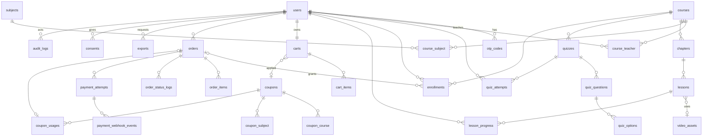

# Mô hình dữ liệu tổng thể — VitaminVui MVP (US-001 → US-014)

**Liên quan:** [README.md](README.md) · [api-contract.md](api-contract.md) · [tasks.md](tasks.md) · ADR-001..004 trong `docs/adr/`

## 0. Quy ước chung (áp dụng cho mọi bảng)

| Quy ước | Nội dung | Lý do |
|---|---|---|
| DB | **MySQL 8.4 LTS (bắt buộc — Quyết định của PO 2026-09-25)**, InnoDB, `ROW_FORMAT=DYNAMIC`, charset `utf8mb4`, **collation `utf8mb4_0900_ai_ci`** (đặt trong `config/database.php` trước migration đầu tiên — DBA #7), isolation **`READ COMMITTED` ở mức session** qua `PDO::MYSQL_ATTR_INIT_COMMAND` (DBA #1, xem §6), `binlog_format=ROW` | Laravel 13 + MySQL 8.4 theo CLAUDE.md mới (Security S1: Laravel 11 và MySQL 8.0 đã hết hỗ trợ). `0900_ai_ci` là collation gốc của MySQL 8, nhanh hơn và ghi rõ "không phân biệt dấu" (`ai`); đổi sau khi đã có dữ liệu sẽ rất tốn kém. |
| Múi giờ | `APP_TIMEZONE=Asia/Ho_Chi_Minh`, connection `timezone => '+07:00'` | App chỉ phục vụ VN, không có DST; tính tuổi (US-001), lọc đơn theo ngày (US-010) theo giờ VN. |
| Tiền | `unsigned INT`, đơn vị **VNĐ**, không số lẻ | MoMo nhận số nguyên VNĐ; tránh sai số float. Giá trị tối đa 4,29 tỷ là đủ dư. |
| Trạng thái/loại | `varchar(20..30)` + PHP backed enum trong `app/Enums` (cast trong Model). **Không dùng `ENUM` của MySQL.** | Thêm giá trị không cần ALTER bảng lớn; dễ chuyển DB. |
| Khoá chính | `id` BIGINT unsigned auto increment. Mã hiển thị ra ngoài (đơn hàng) dùng cột `code` riêng. | Không lộ số thứ tự đơn; tách định danh nội bộ và công khai. |
| Xoá | Soft delete chỉ ở `courses`, `chapters`, `lessons`, `quizzes`, `quiz_questions`, `quiz_options`. Các bảng khác xoá cứng hoặc không xoá. Tài khoản bị xoá theo yêu cầu → **ẩn danh hoá** (`users.anonymized_at`), không xoá cứng để giữ chứng từ đơn hàng (§7). | Theo story US-009 BR5; quiz dùng copy-on-write (mục 3.4); Security S7. |
| Gán hàng loạt (mass assignment) | Mọi model khai báo `$fillable` tường minh; **cấm `$guarded = []`**. Các cột trạng thái/quyền **không bao giờ nằm trong `$fillable`**, chỉ đổi qua Service chuyên trách: `users.role/status/email_verified_at/phone_verified_at/current_session_id/current_device_id/parent_consent_status`, `courses.status/published_at/manual_order/enrollments_count/created_by`, `orders.*` (trừ qua `OrderStateMachine`), `coupons.used_count`, `enrollments.status` | Security S17 |
| Dữ liệu cá nhân nhạy cảm | `users.parent_phone`, `users.parent_email` dùng cast `encrypted` (lưu ciphertext kiểu `text`, không tìm kiếm theo các cột này) | Security S7 — dữ liệu của bên thứ ba (phụ huynh) |
| Unique "chỉ một bản ghi đang hoạt động" | **Generated column STORED** trả `1` khi ở trạng thái cần duy nhất, `NULL` khi không, rồi unique index gồm cột đó. MySQL coi các NULL là khác nhau → các bản ghi lịch sử không vi phạm. | Chống race condition ở tầng DB (enrollment trùng, 2 đơn pending, 2 attempt đang làm). |
| Tên cột thứ tự | `position` (không dùng `order` — từ khoá SQL) | Tránh phải quote. |

## 1. Sơ đồ quan hệ (rút gọn)

## 2. Ước lượng khối lượng

Giả định (cần PO xác nhận, đặc biệt **~100.000 đơn/năm — US-010 đang chờ xác nhận**): năm 1 ~30.000 học sinh, 100k đơn, 1,3 khóa/đơn; tăng ~2x/năm.

| Bảng | Tăng trưởng | Sau 1 năm | Sau 3 năm | Ghi chú |
|---|---|---|---|---|
| users | ~80/ngày | ~30k | ~150k | |
| orders | ~275/ngày (đỉnh chiến dịch x5) | 100k | ~700k | |
| order_items | ~360/ngày | 130k | ~900k | |
| payment_attempts | ~1,5 × orders | 150k | ~1M | |
| payment_webhook_events | ~3 × orders (IPN + query đối soát), ~2 KB JSON/dòng | 300k (~600 MB) | ~1,2M (~2,4 GB, sau khi dọn >24 tháng) | Dọn bằng `payments:purge-webhook-events` (T30) |
| audit_logs | ~500–2.000/ngày (thao tác staff, đăng nhập staff, xem chi tiết đơn, xuất file) | ~500k | ~1,5M (giữ 24 tháng) | Chỉ ghi thêm |
| consents | ~2–3 × users | ~90k | ~450k | Không xoá khi còn tài khoản |
| enrollments | ~1,3 × orders + miễn phí | ~150k | ~1M | |
| **lesson_progress** | enrollments × ~30 bài có xem | **~4,5M** | **~30M** | **Bảng lớn nhất + ghi nhiều nhất** (heartbeat) |
| quiz_attempts | ~30 attempt/HS/năm | ~1M | ~7M | Câu trả lời lưu JSON trong attempt (không tách bảng answers — xem 3.6) |
| courses/chapters/lessons | vài trăm / vài nghìn / vài chục nghìn | | | Nhỏ |
| coupons, coupon_usages | nhỏ / ≤ số đơn có mã | | | |
| exports | vài chục/ngày, xoá file sau 24h | | | |

Tải ghi đỉnh: heartbeat video 1 lần/20 giây/người xem → 1.000 người xem đồng thời ≈ **50 UPDATE/giây** vào `lesson_progress` (DBA xác nhận là tải nhẹ với InnoDB; ước lượng ~7–9 GB kể cả index sau 3 năm; không cần partition ở MVP).

**Mốc theo dõi cụ thể cho `lesson_progress` (DBA #10):** chuyển sang bảng tổng hợp tiến độ (`enrollment_progress_summary`, cập nhật khi một bài chuyển `completed`) khi **một trong hai** điều kiện xảy ra: (a) p95 thời gian phản hồi `GET /me/courses` hoặc `GET /learn/courses/{id}` > **300 ms** trong 7 ngày liên tiếp (đo bằng log `X-Request-Id` + thời gian xử lý); (b) `lesson_progress` vượt **20 triệu dòng**. Nếu sau này cần lưu trữ theo năm học bằng partition RANGE, phải đổi PK thành `(id, created_at)` và unique thành gồm `created_at` — là migration cấu trúc lớn, cần DBA lên kế hoạch riêng.

## 3. Chi tiết bảng

Ký hiệu: **U** = unique, **IX** = index, **FK** = khoá ngoại (mặc định `restrictOnDelete` trừ khi ghi khác).

### 3.1 Tài khoản & xác thực (US-001, US-014)

**users**
| Cột | Kiểu | Null | Default | Index/FK | Ghi chú |
|---|---|---|---|---|---|
| id | bigint unsigned | | | PK | |
| name | varchar(150) | N | | | Escape khi hiển thị (XSS) |
| email | varchar(254) | Y | | **U** | Lưu lowercase. 254 = giới hạn RFC 5321 (DBA #8). Nullable để mở đường "chỉ SĐT" (câu hỏi mở US-001); MVP Form Request vẫn bắt buộc cả 2 theo AC1 |
| phone | varchar(20) | Y | | **U** | Chuẩn hoá về dạng `0xxxxxxxxx` (10 số) trước khi lưu/tra cứu |
| password | varchar(255) | N | | | bcrypt (Hash facade) |
| role | varchar(20) | N | `hoc_sinh` | IX | `admin` / `quan_ly_trang` / `giao_vien` / `hoc_sinh` (enum `UserRole`) |
| status | varchar(20) | N | `active` | | `active` / `locked` |
| grade_level | tinyint unsigned | Y | | | 6–12; CHECK `grade_level BETWEEN 6 AND 12`; bắt buộc với học sinh (tầng app) |
| date_of_birth | date | Y | | | Bắt buộc với học sinh (tầng app) |
| parent_phone | text (cast `encrypted`) | Y | | | Bắt buộc ≥1 trong 2 nếu dưới ngưỡng tuổi lúc đăng ký. Ciphertext (S7) |
| parent_email | text (cast `encrypted`) | Y | | | Ciphertext (S7). Chỉ trả ra ở `/auth/me` của chính HS và màn chi tiết HS cho Admin (có audit) |
| parent_consent_status | varchar(20) | N | `not_required` | | `not_required` / `pending` / `granted` / `revoked` — US-017 (chờ BA viết story, chờ pháp chế) |
| referral_code_used | varchar(50) | Y | | | **[Chờ PO]** chỉ lưu, không validate; bật/tắt bằng `features.referral_code` |
| email_verified_at | datetime | Y | | | |
| phone_verified_at | datetime | Y | | | |
| bio | text | Y | | | Mô tả ngắn giáo viên (US-003 AC6). Văn bản thuần |
| avatar_path | varchar(255) | Y | | | Chỉ lưu tên file ngẫu nhiên trên disk `uploads` (S2) |
| must_change_password | boolean | N | false | | Tài khoản staff tạo bằng command → true; buộc đổi mật khẩu ở lần đăng nhập đầu (S15) |
| password_changed_at | datetime | Y | | | |
| current_session_id | varchar(255) | Y | | | Chỉ dùng cho học sinh — ADR-003. Giá trị `logged_out` sau khi đăng xuất (không set NULL — S11) |
| current_device_id | varchar(64) | Y | | | Chỉ dùng cho học sinh — ADR-003; chỉ nhận UUID hợp lệ |
| last_login_at | datetime | Y | | | |
| anonymized_at | datetime | Y | | | Khi xoá tài khoản theo yêu cầu (US-018): xoá/ghi đè PII, giữ `id` cho đơn hàng |
| remember_token, created_at, updated_at | | | | | Không dùng remember-me cho mọi vai trò (ADR-003, ADR-004) |

Index bổ sung: IX (email_verified_at, phone_verified_at, created_at) cho job dọn tài khoản chưa xác thực (T30).

**otp_codes**
| Cột | Kiểu | Null | Index/FK | Ghi chú |
|---|---|---|---|---|
| id | bigint | | PK | |
| user_id | bigint | N | FK users cascade; IX (user_id, purpose, created_at) | |
| purpose | varchar(30) | N | | `verify_account` / `reset_password` (US-015) / `staff_login_mfa` (S15) / `parent_consent` (US-017) |
| channel | varchar(10) | N | | `email` / `sms`. Production chỉ nhận kênh trong `config('auth.otp.channels')` (MVP: `email`) — S9 |
| destination | varchar(254) | N | | Email/SĐT nhận mã. Mã gắn với đích: đổi email/SĐT → huỷ mã cũ, reset `*_verified_at` (S9) |
| code_hash | varchar(255) | N | | Mã 6 số sinh bằng `random_int` (CSPRNG), lưu `Hash::make`, không bao giờ lưu/ghi log mã rõ |
| expires_at | datetime | N | | now + `auth.otp.ttl_minutes` (mặc định 10) |
| consumed_at | datetime | Y | | Chỉ set bằng `UPDATE ... WHERE id=? AND consumed_at IS NULL` |
| invalidated_at | datetime | Y | | Khi phát mã mới cùng purpose/đích, hoặc hết lượt |
| attempts | tinyint unsigned | N (0) | | **Tăng nguyên tử TRƯỚC khi so mã**: `UPDATE ... SET attempts = attempts + 1 WHERE id=? AND consumed_at IS NULL AND expires_at > now() AND attempts < 5` — 0 dòng ảnh hưởng = coi như sai (S9) |
| created_at, updated_at | | | | |

Giới hạn (S9): verify 5 lần/phút và 20 lần/ngày theo `user_id`; gửi mã: cooldown 60s, ≤ 5/giờ, **≤ 10/ngày/user**; vượt trần ngày → khoá xác thực 24h + ghi `audit_logs`. Dọn `otp_codes` > 30 ngày (T30).

Ghi chú `otp_codes.user_id`: luôn là user được xác thực; với `parent_consent` là HS, còn `destination` là email phụ huynh.

**sessions** — bảng mặc định Laravel 13 (chỉ dùng khi `SESSION_DRIVER=database`; mặc định Redis — ADR-004).
**personal_access_tokens** — do `install:api` tạo, **MVP không phát hành token** (S24); khi làm app mobile phải có `abilities` + `expiration`.

**consents** — bằng chứng đồng ý xử lý dữ liệu (S7, US-017; nội dung pháp lý **cần pháp chế xác nhận**)
| Cột | Kiểu | Null | Index/FK | Ghi chú |
|---|---|---|---|---|
| id | bigint | | PK | |
| user_id | bigint | N | FK users; IX (user_id, type, granted_at) | Chủ thể dữ liệu (HS) |
| type | varchar(30) | N | | `privacy_policy` / `terms` / `parent_consent` / `marketing` |
| policy_version | varchar(20) | N | | Phiên bản văn bản chính sách đã hiển thị (config `privacy.policy_version`) |
| granted_by | varchar(10) | N | | `self` / `parent` |
| channel | varchar(20) | N | | `web_form` / `email_otp` / `email_link` |
| destination_masked | varchar(100) | Y | | Email/SĐT phụ huynh đã che (`ng***@gmail.com`) |
| granted_at | datetime | N | | |
| revoked_at | datetime | Y | | Rút lại đồng ý |
| ip | varchar(45) | Y | | |
| user_agent | varchar(255) | Y | | |
| created_at | datetime | N | | |

Form đăng ký: checkbox đồng ý tách riêng, không tick sẵn; thiếu → 422. Tạo bản ghi trong cùng transaction tạo user.

**audit_logs** — nhật ký thao tác nhạy cảm, chỉ ghi thêm (S15)
| Cột | Kiểu | Null | Index | Ghi chú |
|---|---|---|---|---|
| id | bigint | | PK | |
| actor_id | bigint | Y | IX (actor_id, created_at) | Null = hệ thống |
| actor_role | varchar(20) | Y | | |
| action | varchar(60) | N | IX (action, created_at) | vd `course.publish`, `course.teachers.sync`, `course.price.change`, `coupon.create`, `coupon.deactivate`, `order.refund`, `order.view_pii`, `export.create`, `export.download`, `staff.login`, `staff.login_failed`, `staff.mfa_failed`, `user.lock`, `otp.daily_limit`, `consent.revoke` |
| subject_type | varchar(40) | Y | IX (subject_type, subject_id) | |
| subject_id | bigint | Y | | |
| changes | json | Y | | Trước/sau **đã loại PII và secret** (chỉ giữ tên trường + giá trị không nhạy cảm) |
| ip | varchar(45) | Y | | |
| user_agent | varchar(255) | Y | | |
| created_at | datetime | N | IX (created_at) | Dùng cho job dọn sau 24 tháng |

Ghi từ Service qua `AuditLogger` (không dùng Observer chung). Không có route sửa/xoá; model không có `update()`/`delete()` công khai (ném exception).

### 3.2 Danh mục & nội dung (US-002, US-003, US-009, US-011)

**subjects**
| Cột | Kiểu | Null | Default | Index | Ghi chú |
|---|---|---|---|---|---|
| id | bigint | | | PK | |
| name | varchar(100) | N | | **U** | Collation `utf8mb4_0900_ai_ci` → unique không phân biệt hoa/thường **và dấu** (US-011 BR1): "Hình học" = "Hinh hoc" → coi là trùng; chấp nhận được. Test xác nhận ở T01 |
| slug | varchar(120) | N | | **U** | Sinh bằng `Str::slug` (hỗ trợ tiếng Việt), thêm hậu tố nếu trùng |
| status | varchar(10) | N | `active` | | `active` / `hidden` |
| created_at, updated_at | | | | | |

**courses**
| Cột | Kiểu | Null | Default | Index/FK | Ghi chú |
|---|---|---|---|---|---|
| id | bigint | | | PK | |
| title | varchar(255) | N | | | |
| slug | varchar(270) | N | | **U** | Tự sinh, thêm hậu tố `-2`, `-3` khi trùng |
| short_description | varchar(500) | Y | | | |
| description | mediumtext | Y | | | HTML đã sanitize bằng Purifier theo allowlist ở api-contract §4 (S8) — sanitize khi ghi **và** khi trả ra trong API Resource |
| grade_level | tinyint unsigned | N | | IX (status, grade_level) | CHECK 6–12 |
| price | int unsigned | N | 0 | | 0 = miễn phí (US-003 BR5). CHECK ≥ 0 tự nhiên nhờ unsigned |
| thumbnail_path | varchar(255) | Y | | | Tên file ngẫu nhiên (`{uuid}.webp`) trên disk `uploads`, phục vụ từ **tên miền tĩnh riêng không chia sẻ cookie** (`STATIC_URL`). Ảnh đã được server mã hoá lại, bỏ EXIF; không nhận SVG/GIF (S2) |
| status | varchar(20) | N | `draft` | IX | `draft` / `published` / `unpublished` |
| published_at | datetime | Y | | | Set lần đầu publish |
| manual_order | int | Y | | | Sắp xếp "Nổi bật"; tie-break `published_at desc, id desc` |
| enrollments_count | int unsigned | N | 0 | | **Denormalize** số enrollment `active` (US-002 BR6, US-003 BR7). Cập nhật trong cùng transaction khi enrollment vào/ra `active`; job đêm đối soát lại |
| search_text | varchar(1000) | N | '' | | `mb_strtolower(Str::ascii(title + short_description))` (bỏ dấu, đ→d) — tìm kiếm không dấu (US-002 AC5). Cập nhật trong `saving` |
| created_by | bigint | N | | FK users | Người tạo (staff hoặc giáo viên) |
| created_at, updated_at, deleted_at | | | | | Soft delete |

Danh mục chỉ vài trăm khóa → quét `search_text LIKE %từ%` là đủ; không cần FULLTEXT ở MVP. Từ khoá phải **escape `%`, `_`, `\`** trước khi đưa vào `LIKE` (vẫn dùng binding) — S24; helper `App\Support\Like::contains($term)`.

**course_subject**: `course_id` FK cascade, `subject_id` FK restrict (chặn xoá cứng chuyên đề đang dùng — US-011 AC3). PK (course_id, subject_id), IX (subject_id).

**course_teacher**: `course_id` FK cascade, `user_id` FK restrict, `added_by` FK users null, `created_at` (NOT NULL DEFAULT CURRENT_TIMESTAMP — `attach()` của Eloquent không ghi timestamp cho pivot chỉ có created_at). PK (course_id, user_id), IX (user_id). Ràng buộc "user phải là `giao_vien`" và "tối thiểu 1 giáo viên" ở `CourseTeacherService` (khoá dòng course khi gỡ).

**chapters**: id, `course_id` FK, `title` varchar(255), `position` int unsigned, timestamps, deleted_at. IX (course_id, position).

**lessons**
| Cột | Kiểu | Null | Default | Index/FK | Ghi chú |
|---|---|---|---|---|---|
| id | bigint | | | PK | |
| course_id | bigint | N | | FK courses; IX (course_id) | Denormalize để kiểm quyền/tính tiến độ không phải join chapters |
| chapter_id | bigint | N | | FK chapters; IX (chapter_id, position) | |
| title | varchar(255) | N | | | |
| position | int unsigned | N | | | Thứ tự trong chương; thứ tự toàn khóa = (chapter.position, lesson.position) |
| video_source | varchar(20) | N | `none` | | `none` / `upload` / `external_link` (US-009 BR10) |
| video_asset_id | bigint | Y | | FK video_assets null on delete | Khi `upload` |
| external_provider | varchar(10) | Y | | | `youtube` / `vimeo` — khi `external_link` |
| external_video_id | varchar(32) | Y | | | ID video bắt được bằng regex chặt (YouTube `[A-Za-z0-9_-]{11}`, Vimeo `\d{6,12}`). **Không lưu/không dùng lại nguyên URL người nhập**; URL embed dựng lại từ ID (S13). Mặc định chỉ cho phép khi `is_preview = true` (chờ PO) |
| duration_seconds | int unsigned | Y | | | Từ webhook video (upload) hoặc nhập tay (external) |
| is_preview | boolean | N | false | | |
| created_at, updated_at, deleted_at | | | | | |

**video_assets** (tầng nghiệp vụ, độc lập nhà cung cấp — ADR-002)
| Cột | Kiểu | Null | Index | Ghi chú |
|---|---|---|---|---|
| id | bigint | | PK | |
| provider | varchar(20) | N | **U** (provider, provider_video_id) | `internal` / `bunny` |
| provider_library_id | varchar(50) | N | | |
| provider_video_id | varchar(64) | N | | GUID bên provider |
| status | varchar(20) | N | IX (status, updated_at) | `created` / `uploading` / `processing` / `ready` / `failed` |
| duration_seconds | int unsigned | Y | | |
| original_filename | varchar(255) | Y | | |
| size_bytes | bigint unsigned | Y | | |
| error_message | varchar(500) | Y | | |
| lesson_id | bigint | N | FK lessons; IX | Asset chỉ thuộc đúng 1 bài; `lessons.video_asset_id` chỉ được gán bởi `LessonVideoUploadController` của chính bài đó (S5) |
| declared_size_bytes | bigint unsigned | N | | Kích thước khai báo lúc tạo phiên upload; TUS không nhận `Upload-Length` lớn hơn (S3) |
| created_by | bigint | N | FK users; IX (created_by, created_at) | Dùng cho hạn mức upload/ngày |
| created_at, updated_at | | | | |

Bảng riêng của module VideoLab (`vl_videos`, có cột `max_bytes`, `upload_expires_at`) mô tả trong ADR-002 — không được bảng nghiệp vụ tham chiếu FK tới.

### 3.3 Ghi danh & tiến độ (US-003, US-006, US-008, US-012)

**enrollments** — mỗi lần xin học/mua là 1 dòng (giữ lịch sử từ chối/thu hồi).
| Cột | Kiểu | Null | Default | Index/FK | Ghi chú |
|---|---|---|---|---|---|
| id | bigint | | | PK | |
| user_id | bigint | N | | FK users | |
| course_id | bigint | N | | FK courses | |
| status | varchar(20) | N | | | `pending_approval` / `active` / `rejected` / `revoked` |
| source | varchar(20) | N | | | `purchase` / `free_approval` (sau này `admin_grant`) |
| order_id | bigint | Y | | FK orders; IX | Khi `purchase` |
| requested_at | datetime | Y | | | Khi `free_approval` |
| approved_by | bigint | Y | | FK users | |
| approved_at | datetime | Y | | | |
| rejection_reason | varchar(1000) | Y | | | |
| activated_at | datetime | Y | | | = `purchased_at` của story |
| revoked_at | datetime | Y | | | |
| revoked_reason | varchar(50) | Y | | | `refund` / ... |
| last_accessed_at | datetime | Y | | | Cập nhật khi mở bài (US-008 AC4) — ghi tối đa 1 lần/5 phút |
| **live_flag** | tinyint, **generated STORED** | Y | | | `CASE WHEN status IN ('pending_approval','active') THEN 1 END` |
| created_at, updated_at | | | | | |

Index:
- **U (user_id, course_id, live_flag)** → mỗi HS tối đa 1 enrollment đang chờ duyệt *hoặc* đang học cho 1 khóa (US-012 BR5, chống IPN tạo trùng). Dòng `rejected`/`revoked` có `live_flag = NULL` nên không chặn gửi lại (US-012 AC5) hay mua lại sau hoàn tiền.
- IX (course_id, status, requested_at) → danh sách chờ duyệt (US-012 AC7).
- IX (user_id, status, last_accessed_at) → "Khóa học của tôi" (US-008).

**lesson_progress**
| Cột | Kiểu | Null | Default | Index/FK | Ghi chú |
|---|---|---|---|---|---|
| id | bigint | | | PK | |
| user_id | bigint | N | | FK users | |
| lesson_id | bigint | N | | FK lessons | |
| course_id | bigint | N | | | Denormalize, **không FK** (giảm chi phí ghi); đếm tiến độ theo khóa không cần join |
| watched_seconds | int unsigned | N | 0 | | Thời gian xem tích lũy đã được server "kẹp" (ADR-002 §Tiến độ) |
| last_position_seconds | int unsigned | N | 0 | | Vị trí để học tiếp |
| status | varchar(20) | N | `in_progress` | | `in_progress` / `completed` |
| completed_at | datetime | Y | | | Không bao giờ quay lại `in_progress` (xem lại không đổi trạng thái) |
| last_accessed_at | datetime | N | | | US-003 BR6 |
| last_heartbeat_at | datetime | Y | | | Dùng để kẹp delta |
| created_at, updated_at | | | | | |

Index: **U (user_id, lesson_id)**; IX (user_id, course_id, status); IX (user_id, course_id, last_accessed_at). → **DBA review** (bảng lớn nhất, ghi nhiều).

Tiến độ khóa (US-008 BR1) **tính khi đọc**, không denormalize ở MVP: `COUNT(lesson_progress completed, join lessons chưa xoá) / COUNT(lessons chưa xoá của khóa)`; 2 truy vấn GROUP BY cho cả trang "Khóa học của tôi" (≤ 12 khóa/trang). Khóa có 0 bài → 0% ("Chưa có nội dung").

### 3.4 Quiz (US-007)

**quizzes**: id, `course_id` FK, `chapter_id` FK null, `lesson_id` FK null, `title`, `time_limit_minutes` smallint unsigned null (**null = không giới hạn; chờ PO** cách cấu hình mặc định), `position`, timestamps, deleted_at. CHECK: đúng 1 trong 2 `chapter_id`/`lesson_id` khác NULL. IX (course_id), (chapter_id), (lesson_id).

**quiz_questions**: id, `quiz_id` FK, `content` text (**văn bản thuần** có đoạn LaTeX `$...$`, không HTML; ≤ 5.000 ký tự — S8), `explanation` text null (văn bản thuần, ≤ 5.000), `position`, `replaced_by_id` bigint null (copy-on-write), timestamps, deleted_at. IX (quiz_id, position). Số câu tối đa/quiz: `quiz.max_questions` = 200 (chờ PO).

**quiz_options**: id, `question_id` FK, `content` text (văn bản thuần + LaTeX, ≤ 1.000), `is_correct` bool, `position` tinyint (A–D), timestamps, deleted_at. Quy tắc "đúng 4 lựa chọn, đúng 1 đáp án đúng" kiểm ở `QuizContentService` (không ép ở DB). `is_correct`/`explanation` **không bao giờ** có trong Resource của lượt đang làm (I3).

**Copy-on-write:** sửa/xoá một câu hỏi đã có ít nhất 1 attempt tham chiếu → soft delete câu cũ + tạo câu mới (cùng `position`), không UPDATE tại chỗ. Attempt cũ đọc câu hỏi bằng `withTrashed()` → kết quả cũ giữ nguyên (US-007 edge case) mà không phải lưu snapshot nội dung (tiết kiệm hàng chục GB/năm).

**quiz_attempts**
| Cột | Kiểu | Null | Default | Index | Ghi chú |
|---|---|---|---|---|---|
| id | bigint | | | PK | |
| user_id | bigint | N | | FK users | |
| quiz_id | bigint | N | | FK quizzes | |
| course_id | bigint | N | | | Denormalize cho US-008 AC5 |
| question_ids | json | N | | | Danh sách câu hỏi (đúng thứ tự) chốt lúc bắt đầu |
| answers | json | N | `{}` | | `{"<question_id>": <option_id>}` — autosave bằng `JSON_SET` 1 câu lệnh (nguyên tử, không mất cập nhật khi 2 request song song) |
| result | json | Y | | | Sau khi chấm: `{"<qid>": {"selected": x, "correct": y, "ok": true}}` (~2 KB/50 câu) |
| started_at | datetime | N | | | Giờ server |
| expires_at | datetime | Y | | IX (submitted_at, expires_at) | `started_at + time_limit` (null nếu không giới hạn) |
| submitted_at | datetime | Y | | | |
| auto_submitted | boolean | N | false | | |
| total_questions | smallint unsigned | N | | | |
| correct_count | smallint unsigned | Y | | | |
| score | decimal(4,2) | Y | | IX (user_id, quiz_id, score) | Thang 10 |
| **in_progress_flag** | tinyint generated STORED | Y | | | `CASE WHEN submitted_at IS NULL THEN 1 END` |
| created_at, updated_at | | | | | |

CHECK `chk_quiz_attempts_question_count`: `JSON_LENGTH(question_ids) BETWEEN 1 AND 200` (DBA #6; khớp `quiz.max_questions`).

**U (user_id, quiz_id, in_progress_flag)** → mỗi HS chỉ có 1 lượt đang làm/quiz; "bắt đầu" lần 2 trả lại lượt đang làm (resume). Nộp bài = `UPDATE ... WHERE id=? AND submitted_at IS NULL` → double submit chỉ 1 lần có hiệu lực.

Quyết định **không tách bảng `quiz_attempt_answers`** như story gợi ý: tránh bảng 10–20M dòng/năm; nếu sau này cần thống kê theo câu hỏi thì dựng bảng tổng hợp từ `result`.

### 3.5 Giỏ hàng, mã giảm giá, đơn hàng, thanh toán (US-004, US-005, US-010, US-013)

**carts**: id, `user_id` **U** FK cascade, `coupon_id` FK null (null on delete), timestamps. Tạo lazy khi HS thêm khóa đầu tiên. Dòng `carts` là **khoá tuần tự hoá** mọi thao tác giỏ/checkout của 1 HS (`lockForUpdate`).

**cart_items**: id, `cart_id` FK cascade, `course_id` FK cascade, created_at. **U (cart_id, course_id)** (US-004 BR2, race 2 tab).

**coupons**
| Cột | Kiểu | Null | Default | Index | Ghi chú |
|---|---|---|---|---|---|
| id | bigint | | | PK | |
| code | varchar(50) | N | | **U** | Lưu UPPERCASE, so khớp sau `strtoupper(trim())` + collation `_ci` (BR1). Khuyến nghị mã riêng tư ≥ 8 ký tự ngẫu nhiên (S18) |
| name | varchar(255) | Y | | | Tên chương trình (văn bản thuần) |
| discount_type | varchar(20) | N | | | `percent` / `fixed_amount` |
| discount_value | int unsigned | N | | | percent: 1–100; fixed: VNĐ. CHECK `chk_coupons_percent_range`: `discount_type <> 'percent' OR discount_value BETWEEN 1 AND 100` (DBA #5) |
| max_uses | int unsigned | Y | | | null = không giới hạn. **Bắt buộc** (cùng `valid_until`) khi mã giảm 100% — CHECK `chk_coupons_full_discount_limited`: `NOT (discount_type = 'percent' AND discount_value = 100) OR (max_uses IS NOT NULL AND valid_until IS NOT NULL)`; với mã cố định ≥ giá khóa rẻ nhất đang bán: kiểm ở app + ghi `audit_logs` (S18) |
| used_count | int unsigned | N | 0 | | Số lượt **đã dùng** = số dòng `coupon_usages` (denormalize, tăng khi đơn `paid`) |
| valid_from | datetime | N | | | |
| valid_until | datetime | Y | | | ≥ valid_from |
| status | varchar(20) | N | `active` | IX (status, valid_until) | `active` / `inactive` |
| is_restricted | boolean | N | false | | false = toàn bộ khóa học; true = theo `coupon_course` ∪ `coupon_subject` |
| created_by | bigint | N | | FK users | |
| created_at, updated_at | | | | | |

`max_uses_per_user` **không lưu cột** — PO chốt cố định = 1, ép bằng unique ở `coupon_usages`.

**coupon_course** (coupon_id, course_id) PK; **coupon_subject** (coupon_id, subject_id) PK. Phạm vi = khóa trong `coupon_course` **HOẶC** thuộc ≥1 chuyên đề trong `coupon_subject` (diễn giải "chuyên đề và/hoặc khóa học" là **hợp** — cần PO xác nhận). Chuyên đề bị ẩn vẫn tính (US-011 edge case).

**coupon_usages**: id, `coupon_id` FK, `user_id` FK, `order_id` FK **U**, `used_at`. **U (coupon_id, user_id)** → mỗi HS dùng mỗi mã đúng 1 lần (US-013 BR3) ở tầng DB. Không xoá khi hoàn tiền (lượt đã dùng không trả lại — **giả định, chờ PO**).

**orders**
| Cột | Kiểu | Null | Default | Index/FK | Ghi chú |
|---|---|---|---|---|---|
| id | bigint | | | PK | |
| code | varchar(20) | N | | **U** | `VV` + `yymmdd` + 6 ký tự Crockford base32 ngẫu nhiên; hiển thị cho HS/admin |
| user_id | bigint | N | | FK users | |
| status | varchar(20) | N | `pending` | | `pending` / `paid` / `failed` / `cancelled` / `refunded` |
| status_reason | varchar(100) | Y | | | `expired_12h`, `superseded`, `gateway_failed:<code>`, `zero_amount`, `admin_refund`... (US-010 AC3) |
| subtotal_amount | int unsigned | N | | | Tổng giá chốt |
| discount_amount | int unsigned | N | 0 | | |
| total_amount | int unsigned | N | | | = subtotal − discount (CHECK ≥ 0 nhờ app + unsigned) |
| coupon_id | bigint | Y | | FK coupons | |
| coupon_code | varchar(50) | Y | | | Snapshot |
| coupon_hold_until | datetime | Y | | | Đơn pending chỉ "giữ chỗ" lượt mã tới thời điểm này (= hạn link thanh toán, ≤ 30 phút — S18). Tạo link mới sau mốc này phải kiểm lại sức chứa (ADR-001 §6) |
| payment_method | varchar(20) | Y | | | `momo` / `none` (đơn 0đ). Mở rộng được |
| payment_reference | varchar(100) | Y | | | Mã giao dịch cổng (MoMo `transId`) của attempt thành công |
| needs_review | boolean | N | false | IX (needs_review, created_at) | Bật khi có bất thường tiền (lệch số tiền, thanh toán trùng, trả tiền muộn...) |
| expires_at | datetime | N | | | created_at + `orders.pending_ttl_hours` (12) |
| paid_at, cancelled_at, refunded_at | datetime | Y | | | |
| refunded_by | bigint | Y | | FK users | |
| refund_note | varchar(1000) | Y | | | |
| **pending_flag** | tinyint generated STORED | Y | | | `CASE WHEN status='pending' THEN 1 END` |
| created_at, updated_at | | | | | |

Index: **U (user_id, pending_flag)** (mỗi HS tối đa 1 đơn pending — chống 2 tab tạo 2 đơn); IX (status, created_at); IX (created_at); IX (user_id, created_at); IX (coupon_id, status); IX (status, expires_at) cho job huỷ 12h. DBA đã xác nhận đủ.

**Phân trang danh sách đơn quản trị (DBA #9):** dùng **`cursorPaginate()` (keyset)** theo `orderByDesc('created_at')->orderByDesc('id')`, không OFFSET. UI chỉ có "Trước/Tiếp" + tổng số bản ghi khớp bộ lọc (một câu `COUNT(*)` riêng trên cùng bộ lọc, khoảng ngày bắt buộc ≤ 366 ngày). Designer cập nhật mockup US-010 (chờ PO xác nhận UX). Ô tìm kiếm tự do: xem api-contract §2.5 — luôn áp bộ lọc ngày/trạng thái trước, mã đơn tra `orders.code`, tên HS dùng `LIKE 'từ%'` (đã escape) trong phạm vi đã thu hẹp.

**order_items**: id, `order_id` FK cascade, `course_id` FK, `course_title` varchar(255) snapshot, `unit_price` int (giá chốt), `discount_amount` int (phân bổ giảm giá theo tỷ lệ, phần dư dồn vào dòng cuối), `final_amount` int. **U (order_id, course_id)**, IX (course_id).

**order_status_logs**: id, `order_id` FK cascade, `from_status` null, `to_status`, `reason` varchar(100) null, `actor_type` varchar(10) (`system`/`user`/`gateway`), `actor_id` null, `meta` json null, `created_at`. IX (order_id, id). Phục vụ "lịch sử trạng thái" + lý do huỷ (US-010 AC3).

**payment_attempts** — mỗi lần tạo link thanh toán với cổng (ADR-001)
| Cột | Kiểu | Null | Index | Ghi chú |
|---|---|---|---|---|
| id | bigint | | PK | |
| order_id | bigint | N | FK; IX (order_id, id) | |
| gateway | varchar(20) | N | | `momo` |
| gateway_order_id | varchar(64) | N | **U (gateway, gateway_order_id)** | Gửi sang MoMo làm `orderId` — `{order.code}-{n}` (MoMo yêu cầu duy nhất mỗi request) |
| request_id | varchar(64) | N | | UUID, gửi làm `requestId`, log để truy vết |
| amount | int unsigned | N | | = order.total_amount lúc tạo |
| status | varchar(20) | N | IX (status, created_at); IX (status, next_check_at) | `created` / `pending` / `succeeded` / `failed` / `expired` / `error`. `failed`/`expired` chỉ khi cổng xác nhận (ADR-001 §3) |
| next_check_at | datetime | Y | | Lần đối soát kế tiếp (ADR-001 §7b); tạo attempt → now + 3 phút |
| check_count | smallint unsigned | N (0) | | Số lần đã query |
| last_checked_at | datetime | Y | | |
| pay_url | varchar(1000) | Y | | |
| expires_at | datetime | Y | | Hạn link phía cổng |
| gateway_trans_id | varchar(64) | Y | **U (gateway, gateway_trans_id)** | MySQL cho phép nhiều NULL |
| result_code | varchar(20) | Y | | |
| result_message | varchar(255) | Y | | |
| create_response | json | Y | | Phản hồi khi tạo (đã bỏ trường nhạy cảm nếu có) |
| created_at, updated_at | | | | |

**payment_webhook_events** — nhật ký thô mọi IPN (kể cả chữ ký sai) **và mọi phản hồi query đối soát**, phục vụ đối soát/tranh chấp
| Cột | Kiểu | Null | Index | Ghi chú |
|---|---|---|---|---|
| id | bigint | | PK | |
| gateway | varchar(20) | N | | |
| source | varchar(10) | N | | `ipn` / `query` |
| payment_attempt_id | bigint | Y | IX | Null nếu không khớp attempt |
| gateway_order_id | varchar(64) | Y | IX | Lấy từ payload (chưa tin cậy nếu chữ ký sai) |
| signature_valid | boolean | N | | |
| amount_matched | boolean | Y | | |
| outcome | varchar(30) | N | | `processed` / `duplicate` / `rejected_signature` / `rejected_amount` / `unknown_attempt` / `error` |
| payload | json | N | | **Chỉ các trường đã biết** của MoMo (allowlist trong adapter), bỏ `signature`; body > 16 KB bị chặn trước khi tới app (S12) |
| ip | varchar(45) | Y | | Null với `source = query` |
| received_at | datetime | N | **IX (received_at)** | Index đơn theo thời gian cho job dọn 24 tháng và tra cứu theo khoảng ngày (DBA #4 — bỏ index `(gateway, received_at)` vì `gateway` gần như hằng số) |

**Cố ý KHÔNG đặt unique trên event** (vd. requestId+resultCode): khoá này lấy từ payload chưa xác thực, kẻ tấn công có thể gửi trước 1 payload giả cùng khoá làm IPN thật bị coi là "trùng". Idempotency đảm bảo bằng **trạng thái order/attempt dưới row lock** (ADR-001).

### 3.6 Xuất báo cáo (US-010)

**exports**: id, `user_id` FK, `type` varchar(30) (`orders`), `format` (`csv`/`xlsx`), `filters` json, `include_contact` boolean default false (chỉ Admin được bật, kèm `reason` varchar(255) bắt buộc khi bật — S14), `status` (`queued`/`processing`/`done`/`failed`), `row_count` int null, `disk` (`exports`, private, không nằm dưới `storage/app/public`), `file_path` null, `error` varchar(500) null, `expires_at` (done + 24h), timestamps. IX (user_id, created_at) — cũng dùng để đếm giới hạn 10 lần xuất/ngày/người. Metadata giữ lại làm bằng chứng audit; chỉ file bị xoá.

### 3.7 Hạ tầng Laravel

`jobs`, `job_batches`, `failed_jobs`, `cache`, `cache_locks`, `sessions` (mặc định Laravel 13). Mặc định Redis cho session/cache/queue/rate limiter, **tách database Redis riêng** cho từng loại (session=1, cache=2, queue=3, limiter=4) để `cache:clear` không xoá phiên và bộ đếm throttle (S22). Các bảng DB tương ứng chỉ để dự phòng. `failed_jobs` được dọn sau 7 ngày (`queue:prune-failed --hours=168`); job chứa PII dùng `ShouldBeEncrypted` (S21).

## 4. Các ràng buộc chống trùng/race quan trọng (tóm tắt cho QA/Security)

| Rủi ro | Chốt chặn DB | Chốt chặn ứng dụng |
|---|---|---|
| Trùng email/SĐT khi đăng ký đồng thời | U `users.email`, U `users.phone` | Bắt `QueryException` 23000 → trả 422 đúng field |
| Thêm trùng khóa vào giỏ (2 tab) | U (cart_id, course_id) | `insertOrIgnore` / bắt lỗi unique → "đã có trong giỏ" |
| 2 tab checkout tạo 2 đơn | U (user_id, pending_flag) | Khoá dòng `carts` + tái sử dụng đơn pending cùng nội dung |
| IPN gọi nhiều lần | U enrollments (user, course, live_flag); U coupon_usages.order_id | Khoá dòng order, chỉ chuyển trạng thái nếu chưa `paid` |
| HS dùng lại mã | U coupon_usages (coupon_id, user_id) | Kiểm tra ở bước áp mã & tạo đơn |
| Mã vượt `max_uses` | — | Khoá dòng `coupons` khi tạo đơn/tạo link mới; sức chứa = `used_count` + số đơn pending có `coupon_hold_until > now` (ADR-001 §6) |
| Gửi trùng yêu cầu học miễn phí / double click duyệt | U enrollments (user, course, live_flag) | Duyệt = UPDATE có điều kiện `WHERE status='pending_approval'` |
| Double submit quiz / 2 lượt đang làm | U (user, quiz, in_progress_flag) | Nộp = UPDATE có điều kiện `submitted_at IS NULL` |
| Hoàn tiền 2 lần | — | Khoá dòng order, chỉ cho `paid → refunded` |
| Trùng tiến độ bài học | U (user_id, lesson_id) | `upsert` |

**Thứ tự khoá chuẩn DUY NHẤT (DBA #2 — khớp ADR-001 §4):**
`carts (của user)` → `orders` → `payment_attempts` → `courses` (khoá SHARE ở checkout, EXCLUSIVE ở fulfillment/xoá/ngừng bán; nhiều khóa khoá theo **id tăng dần**) → `enrollments` → `coupons` / `coupon_usages`. `courses.enrollments_count` được tăng ngay trong `EnrollmentService::grantPurchase` khi đã giữ khoá `courses` X (không còn bước "courses ở cuối"). **T18 chốt (2026-10-06):** `EnrollmentService` khoá `courses` trước `enrollments`, nên `courses` phải đứng trước `coupons` để không deadlock checkout ↔ IPN.
Mọi luồng chỉ được đi **một đoạn con theo đúng chiều này**: checkout = `carts → orders → courses(S) → coupons`; fulfillment (IPN/đối soát) = `carts → orders → payment_attempts → courses(X) → enrollments → coupons → coupon_usages`; huỷ 12h = `carts → orders → payment_attempts`; duyệt miễn phí = `courses → enrollments`; hoàn tiền = `orders → courses → enrollments`. Luồng mới phải tuân thủ và ghi rõ trong PR. Mọi transaction nhiều bảng dùng `DB::transaction($fn, 3)`; hết 3 lần vẫn lỗi → log `critical` kèm `request_id` (không 500 âm thầm). Hot row cần load test trước chiến dịch lớn: `coupons` (nhiều HS cùng mã), `courses.enrollments_count` (khóa bán chạy).

**Chỉ khoá dòng chắc chắn tồn tại** (`carts` của HS — tạo trước bằng `firstOrCreate` ngoài transaction; `orders`, `coupons` theo PK). Không dùng `SELECT ... FOR UPDATE` để "kiểm tra chưa tồn tại" (vd tìm đơn pending khi chưa có): tìm bằng đọc thường, nếu có thì khoá theo PK rồi kiểm lại trạng thái. Dòng `carts` đóng vai trò mutex theo học sinh cho giỏ/checkout/IPN; phần còn lại dựa vào unique index. Chi tiết InnoDB (gap lock, isolation) ở §6.

## 5. Kế hoạch migration

Dự án mới (greenfield) → chưa có vấn đề zero-downtime; tạo migration theo thứ tự phụ thuộc:

1. Laravel mặc định (`users` sửa lại theo 3.1, `cache`, `jobs`, `sessions`) + `personal_access_tokens` (`install:api`) + **`audit_logs`** (T02).
2. `otp_codes`, **`consents`** (T03/T04).
3. `subjects` → `courses` → `course_subject`, `course_teacher` → `chapters` → `video_assets` → `lessons`.
4. `coupons` → `coupon_course`, `coupon_subject`.
5. `carts` → `cart_items`.
6. `orders` → `order_items`, `order_status_logs`, `payment_attempts`, `payment_webhook_events`, `coupon_usages`.
7. `enrollments` (FK orders) → `lesson_progress`.
8. `quizzes` → `quiz_questions` → `quiz_options` → `quiz_attempts`.
9. `exports`.
10. Module VideoLab: `vl_videos` (migration nằm trong module, chỉ chạy khi `VIDEO_PROVIDER=internal`).

Generated column & CHECK: dùng `->storedAs(...)` và `DB::statement('ALTER TABLE ... ADD CONSTRAINT chk_<bảng>_<ý nghĩa> CHECK (...)')` — **luôn đặt tên constraint tường minh** để `down()` chạy được `ALTER TABLE ... DROP CHECK chk_...`. Danh sách CHECK: `chk_users_grade_level`, `chk_quizzes_single_parent`, `chk_quiz_attempts_question_count`, `chk_coupons_percent_range`, `chk_coupons_full_discount_limited`, `chk_courses_grade_level`. Chạy checklist kiểm chứng ở `docs/db/design-review.md` §5 trước khi merge migration đầu tiên (T07).

Từ release thứ 2 trở đi áp dụng quy tắc chung: thêm cột nullable/có default trước → backfill theo lô (command, `chunkById`) → siết ràng buộc ở release sau; không đổi tên/xoá cột đang dùng trong cùng release.

## 6. Lưu ý riêng MySQL 8 / InnoDB

| Chủ đề | Quyết định | Lý do |
|---|---|---|
| Isolation level | **Mức session/connection** (DBA #1 — Laravel không có khoá `isolation_level` cho driver `mysql`): trong `config/database.php`, connection `mysql` → `'options' => extension_loaded('pdo_mysql') ? array_filter([PDO::MYSQL_ATTR_SSL_CA => env('MYSQL_ATTR_SSL_CA'), PDO::MYSQL_ATTR_INIT_COMMAND => 'SET SESSION TRANSACTION ISOLATION LEVEL READ COMMITTED']) : []`. Kiểm chứng: `SELECT @@transaction_isolation` = `READ-COMMITTED` (test trong T01). Không dùng phương án set theo từng transaction (dễ quên). Rà code T18–T20, T22: không dựa vào snapshot nhất quán giữa nhiều SELECT thường trong 1 transaction | Ở `REPEATABLE READ` mặc định: (1) đọc thường trong transaction dùng snapshot tạo ở lần đọc đầu → đếm "số đơn pending đang giữ mã" sau khi khoá `coupons` có thể thiếu đơn vừa commit → vượt `max_uses`; (2) locking read trên khoảng rỗng tạo gap lock → deadlock khi 2 HS khác nhau cùng INSERT đơn. `READ COMMITTED` đọc bản mới nhất ở mỗi câu lệnh và gần như không dùng gap lock. Với `binlog_format=ROW` (mặc định 8.0) an toàn cho replication |
| Unique "1 bản ghi đang hoạt động" | Generated column STORED (`CASE WHEN ... THEN 1 END`) + unique index gồm cột đó | MySQL không có partial/filtered index; unique index cho phép nhiều NULL |
| Unique trên cột nullable (`email`, `phone`, `gateway_trans_id`) | Unique index thường | InnoDB cho phép nhiều NULL trong unique index |
| CHECK constraint | Có hiệu lực trên MySQL 8.4; vẫn validate ở Form Request; đặt tên tường minh `chk_*` | Phòng dữ liệu sai từ script/tinker |
| Độ dài index | MySQL 8 + `ROW_FORMAT=DYNAMIC`: giới hạn 3072 byte → `varchar(255)` utf8mb4 index được, **không cần** `Schema::defaultStringLength(191)` | |
| Tìm kiếm không dấu | Cột `search_text` chuẩn hoá bằng PHP (`Str::ascii` + lowercase), không dựa vào collation | Không phụ thuộc cách collation xử lý dấu/`đ`; hành vi giống nhau ở mọi môi trường, test được bằng unit test |
| Autosave quiz | `UPDATE quiz_attempts SET answers = JSON_SET(answers, CONCAT('$."', ?, '"'), ?) WHERE id = ? AND submitted_at IS NULL` (question_id là số nguyên đã validate; vẫn dùng binding) | Nguyên tử trong 1 câu lệnh, không mất cập nhật khi nhiều request song song |
| Khoá bi quan | `lockForUpdate()` chỉ theo PK/unique của dòng đã tồn tại | Tránh khoá khoảng; xem §4 |
| Migration bảng lớn sau này (`lesson_progress`, `orders`, `payment_webhook_events`) | Thêm cột: `ALGORITHM=INSTANT` (8.0.12+) nếu có thể; thêm index: online DDL (`ALGORITHM=INPLACE, LOCK=NONE`); bảng > vài triệu dòng → DBA cân nhắc `gh-ost`/`pt-online-schema-change` | Không khoá bảng giờ cao điểm |
| Collation | `utf8mb4_0900_ai_ci` cho server/database/connection (DBA #7). T01 viết test: tạo 2 chuyên đề "Hình học"/"Hinh hoc" và "Đại số"/"Dai so" → xác nhận hành vi unique đúng mong đợi trước khi merge migration đầu tiên | Chốt 1 lần, trước khi có dữ liệu |
| Bộ đếm denormalize | Cron hằng ngày `counters:recount` đối soát `courses.enrollments_count` (từ `enrollments` active) **và** `coupons.used_count` (từ `coupon_usages`) — DBA #5 | Phòng lệch ở các nhánh `needs_review` |
| Binlog | `binlog_format=ROW` (bắt buộc với READ COMMITTED); tuỳ chọn `binlog_row_value_options=PARTIAL_JSON` sau khi kiểm công cụ backup | |
| `innodb_flush_log_at_trx_commit` | Giữ `1` | Dữ liệu tiền phải durable |

## 7. Thời hạn lưu trữ & job dọn dữ liệu (DBA #3, Security S7/S21 — mặc định an toàn, **chờ PO/pháp chế/kế toán xác nhận**)

| Dữ liệu | Thời hạn mặc định | Cơ chế (task T30) |
|---|---|---|
| `payment_webhook_events` | 24 tháng | `payments:purge-webhook-events` hằng ngày 03:00, xoá theo lô 5.000 dòng + nghỉ 200ms giữa lô, dùng IX(received_at) |
| `audit_logs` | 24 tháng | `audit:purge` hằng tháng, theo lô |
| `otp_codes` | 30 ngày | `otp:prune` hằng ngày |
| Tài khoản HS chưa xác thực (không email/SĐT nào verified) | 7 ngày | `users:purge-unverified` hằng ngày — xoá cứng (chưa có đơn/enrollment), giải phóng email/SĐT (S20) |
| Tài khoản không hoạt động | Không tự xoá ở MVP | Chờ pháp chế |
| File export | 24 giờ (metadata giữ) | `exports:purge` hằng giờ + quét file "mồ côi" > 48h |
| `failed_jobs` | 7 ngày | `queue:prune-failed --hours=168` hằng ngày |
| Log ứng dụng (`laravel`, `payments`, `video`, `playback`) | 90 ngày | logrotate/`daily` channel `days=90` |
| `orders`, `order_items`, `order_status_logs`, `payment_attempts`, `coupon_usages` | **Không xoá** (chứng từ kế toán, thường ≥ 10 năm) | Khi xoá tài khoản: ẩn danh hoá `users`, giữ đơn — cần kế toán xác nhận |
| `consents` | Giữ suốt vòng đời tài khoản + thời hạn pháp chế chốt | |
